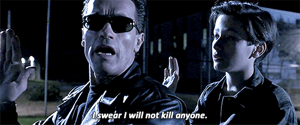

<!-- _class: first-slide -->

<small>🐍 82º Python Floripa</small>

# Equidade e Justiça em Sistemas de IA

**Marília Melo Favalesso**

---
## Marília Melo Favalesso  

🧠 Cientista de Dados | PhD

🐍 Python e Comunidades  

🐈 Gatos, pizza e bicicleta nas horas vagas

🔗 LinkedIn: [/mariliafavalesso](https://www.linkedin.com/in/mariliafavalesso/)

🔗 github: [/mmfava](https://github.com/mmfava)

---
## O que é ==Inteligência Artificial==?

IA é um **conjunto de sistemas automatizados** que tomam **decisões e executam tarefas** que antes exigiam **julgamento humano**.

<small><small>[👁 | 🤖 | 🧠 | 🗣]</small></small>

---
# O impacto das ==decisões algorítmicas==

 
  

  

✶ As IAs tentam imitar o julgamento humano.  ✶ São imperfeitos, enviesados e, muitas vezes, injustos.

---

## Proposta de experimento

▶ Execute o seguinte prompt no chatGPT / DALL-E 3: 

**"Chat, pode gerar a imagem de uma pessoa liderança?"** 

  🤔 Qual foi o resultado? 

---

  
  
  
  
  
  
  
  
  
  

 

<small><small>DALL-E 3 (OpenAI) →🔗 https://chatgpt.com/share/67915ff0-4c64-800e-b74e-176c169d355f</small></small>

---

## Proposta de experimento 2

▶  Adicione ao prompt no chatGPT / DALL-E 3 a palavra "compassiva": 

**"Chat, pode gerar a imagem de uma pessoa liderança compassiva?"**

 🤔 Qual foi o resultado? 

---

  
  
  
  
  
  
  
  
  
  

 

<small><small>DALL-E 3 (OpenAI) →🔗 https://chatgpt.com/share/6792b433-02b0-800e-8352-052e2fb2f531</small></small>

---
## Reflexo da realidade?

❌ ==NÃO!==

Os modelos são **enviesados**!  

<u>Tendências sistemáticas e distorcidas</u> nos resultados!  
* Reforçam e amplificam estereótipos existentes.
* Excluem ou exageram a representação de certos grupos.
* Criam discriminações sistêmicas.

 <small><small>**Ver:** Cheong et al. (2024), Currie et al. (2024), Mandal et al. (2024), Wu et al. (2024), Choudhry et al. (2023) e  Luccioni et al. (2023). </small></small>

<!---- 

Viés em Inteligência Artificial (IA) refere-se a padrões sistemáticos de erro em modelos de aprendizado de máquina que levam a previsões ou decisões injustas, distorcidas ou discriminatórias.

-->

---

#### Case 1: IA gerando imagens racistas

<small><small><small>**G1 (26/10/2023)** - Deputada denuncia IA por gerar imagem racista quando solicitado um personagem negro em uma favela. (🔗[link](https://g1.globo.com/tecnologia/noticia/2023/10/26/deputada-do-rj-diz-que-robo-que-faz-desenhos-ao-estilo-pixar-entregou-imagem-de-mulher-negra-com-arma-na-mao-ao-receber-pedido-de-personagem-em-favela.ghtml)).</small></small></small>
 

<strong>Prompt no <em>Bing Chat</em> da Microsoft (DALL-E):</strong> 
"Uma mulher negra, de cabelos afro, com roupas de estampa africana num cenário de favela".

---
#### Case 2: IA associando raça a crime

%2012.33.08_f345ba01.jpg)

<small><small><small>**Grupo LLM whatsapp (28/10/2024)** - IA da Meta gera imagem de um homem negro ao pedido de "pessoa que efetua atos errados na sociedade". </small></small></small>
 

<strong>Prompt no <em>Meta AI</em> do Whatsapp:</strong> 
"@Meta AI crie a imagem de uma pessoa que efetua atos errados na sociedade".

---
#### Case 3: IA associando raça a reincidência criminal

<small><small><small><mark>Não é de hoje!</mark> **ProPublica (23/05/2016)**: O artigo revela que o algoritmo COMPAS, usado no sistema judicial dos EUA para prever reincidência criminal, tem viés racial: ele superestima o risco de reincidência para pessoas negras (mais falsos positivos) e subestima para pessoas brancas (mais falsos negativos) ([🔗 link](https://www.propublica.org/article/machine-bias-risk-assessments-in-criminal-sentencing)).</small></small></small>
 

---
## Reflexo da sociedade?

✅ ==SIM!== 

As IA carregam nossa **visão de mundo**: 🏘️ ⇢ 👶!  

✶ **Posicionalidade**: nossa cultura e sociedade influenciam nossa percepção.

✶ **Preconceitos e perspectivas humanas influenciam os sistemas de IA!**

---

<small><small><b>Ref:</b> Leslie et al. (2021)</small></small>

---
### A IA amplifica vieses humanos

<small><small><b>Glickman and Sharot (2024)</b></small></small>
* IA reforça viés e influencia humanos a adotá-lo.
* Maior viés em interações humano-IA do que humano-humano.
* Percepção da IA como neutra favorece aceitação de vieses.
* IA imparciais podem melhorar julgamentos humanos.

---

# Mas o que é ser justo?

<!-- _class: first-slide -->

---
# Mas o que é ser <u>justo</u>?

▶ **Responda:** 

Há apenas um leito disponível na UTI e dois pacientes em estado grave:

[1] 🧒 **Criança de 8 anos** - alta chance de recuperação.
[2] 🤰 **Mulher grávida de 32 anos** - sua vida não garante a do bebê.

 🤔 ==Quem deve ser salvo?==

---
## Definição de justiça 👩‍⚖️

#### Complexa!

▶ A noção de justiça **varia entre culturas e contextos**, refletindo valores e normas sociais.

▶ Em IA, é a busca por sistemas ==equitativos==, livres de discriminação ou vieses injustos.

---
# Equidade ≠ Igualdade

A equidade considera **diferenças individuais e estruturais**, garantindo que **todos tenham acesso às mesmas oportunidades**, mesmo que isso signifique **tratamentos diferenciados**.  

#### ⚖️ Tratamentos diferentes podem ser necessário para garantir justiça!  

---
# Construindo um sistema "justo"

<small>(ver: <b>AI Blindspots</b> | MIT Media Lab)</small>

<!-- _class: first-slide -->

---
### 1️⃣ Propósito
 

✶ Propósito é o norte!
✶ IA é a melhor solução?
 ✶ Engajamento comunidade

 <small><small><small> ⚠️  Sem propósito, pode gerar impactos negativos e desperdício de recursos.</small></small></small>

 

<strong>Surto do Ebola (2014) - </strong>
Pesquisadores usaram dados de mobilidade para prever surtos, mas o Ebola se espalha por contato direto. O foco deveria ter sido <b>redes de contato entre infectados</b>.

---

### 2️⃣ Dados
 

==Vieses perpetuam desigualdade==
✶ Especialistas e comunidade
✶ Diversidade e qualidade
✶ Exploratória
✶ <u>Documentação</u>

 

<strong>Liang et al. (2023) - </strong>Detectores de GPT estão enviesados contra "escritores" não-nativos do inglês.</b>

---

### 3️⃣ Abusabilidade
 

Uso **malicioso**!
<small><small>⚠️  Deepfakes, manipulação e desinformação</small></small>  
✶ Antecipar vulnerabilidades
✶ Criar cenário hipotéticos 
✶ Processos de mitigação
✶ Processos de correção

 

<strong>Poder 360 (24/01/2024) - </strong>Deep Fake do Papa Francisco usando casaco da moda e divulgado por grandes veículos de mídia como verdade.  
<a href="https://www.poder360.com.br/internacional/alvo-de-deepfake-papa-pede-regulamentacao-de-ia/" target="_blank">[Link]</a>

---
### 4️⃣ Privacidade

IA pode **comprometer a privacidade dos usuários**.

✶ Segurança desde o design
✶ Avaliação de risco de privacidade
✶ Consentimento dos usuários 
✶ Aprimoramento de privacidade
 <small><small><small> 🧰 Aprendizado federado, privacidade diferencial, desidentificação e enclaves seguros de dados com base no nível de risco</small></small></small>

 
 

<strong>Época Negócios (16/01/2025) - </strong>Brasileiros vendem registro da íris por R$600 para projeto Worldcoin de Sam Altam, CEO da OpenAI
<a href="https://epocanegocios.globo.com/tecnologia/noticia/2025/01/brasileiros-vendem-registro-de-iris-por-r-600-entenda-como-funciona-o-processo-e-quais-os-riscos.ghtml" target="_blank">[Link]</a>

---

### 5️⃣ Proxy

 **Viés oculto em variáveis correlacionadas**!
<small><small><small>⚠️ Um modelo pode **parecer neutro**, mas ainda refletir desigualdades.</small></small></small>
✶ Consultar especialistas 
✶ Remover features correlacionadas
✶ Testes

 <strong>Ribeiro-Dantas et al. (2023) - </strong> O estado civil solteira foi indevidamente apontado como fator de risco para um tipo de câncer de mama. Os autores demonstram que a variável é um proxy de fatores socioeconômicos, como acesso ao diagnóstico médico adequado. 

---
### 6️⃣ Explicabilidade

 ⚠️⚠️⚠️⚠️⚠️
Quem projeta e implementa sistemas algorítmicos tem a ==responsabilidade de explicar decisões críticas== que impactam o bem-estar das pessoas!
⚠️⚠️⚠️⚠️⚠️  

Usuários precisam entender como e por que um algoritmo tomou uma decisão. Confiança só existe quando há explicabilidade.

---

### 7️⃣ Otimização
 

<small>==Desempenho sem equidade não é suficiente==!</small>
✶ *Trade-off* entre acurácia e equidade
✶ KPIs mensuráveis 
✶ Monitoramento de métricas

 <strong>Shanklin et al. (2022) </strong> - O estudo mostra como algoritmos de IA podem perpetuar desigualdades raciais e propõe um método para equilibrar precisão e equidade, evitando discriminação sem comprometer a eficiência. 

---

### 8️⃣ Generalização

==IA precisa se adaptar ao mundo real!==
✶ Mudanças nos dados
✶ Processo de revisão humana 
✶ Alinhar expectativas 
✶ Metrificação 
✶ Planos de retreino e descontinuidade

  

   

<strong>Time (22/01/2010) - </strong> Câmeras da Nikon não reconheciam corretamente rostos asiáticos, exibindo a mensagem "Alguém piscou?" mesmo com os olhos abertos.  
<a href="https://time.com/archive/6906847/are-face-detection-cameras-racist/" target="_blank">[Leia mais]</a>  

  

---

### 9️⃣ Monitoramento

Decisões algorítmicas devem ser **passíveis de revisão** e **correção**
✶ Mecanismos de transparência 
✶ Comunidade
✶ Documentação / Guia!
✶ Dashboards
✶ Regulamentação

---
# Reflexões finais

<!-- _class: first-slide -->

---
# Todos os modelos ==estão errados==

O importante é reconhecer suas limitações e mitigá-las.

---
# A IA ==não é neutra==

Ela carrega os vieses e intenções de quem a desenvolve e dos dados que a alimentam.  
O uso consciente exige entender essas influências.

---
#  O viés algorítmico vai ==além do técnico==!

É um problema social e ético que exige soluções interdisciplinares e centradas no humano.

---
# Acurácia sem equidade é ==insuficiente==.

Precisamos construir IA que seja não apenas eficiente, mas também justa.

---
# IA justa requer ==monitoramento== e ==contestação==.

Usuários devem ter o direito de questionar decisões algorítmicas e exigir transparência.

---

### Referências

1. Cheong, M. et al. (2024). _Investigating Gender and Racial Biases in DALL-E Mini Images_. [Online]. Available at: https://doi.org/10.1145/3649883 [Accessed 24 January 2025].
2. Choudhry, H. S. et al. (2023). _Perception of Race and Sex Diversity in Ophthalmology by Artificial Intelligence: A DALL E-2 Study_. [Online]. Available at: https://doi.org/10.2147/OPTH.S427296 [Accessed 24 January 2025].
3. Currie, G. et al. (2024). _Gender and Ethnicity Bias of Text-to-Image Generative Artificial Intelligence in Medical Imaging, Part 2: Analysis of DALL-E 3_. [Online]. Available at: https://doi.org/10.2967/jnmt.124.268359 [Accessed 24 January 2025].
4. Glickman, M. and Sharot, T. (2024). _How human–AI feedback loops alter human perceptual, emotional and social judgements_. [Online]. Available at: https://www.nature.com/articles/s41562-024-02077-2 [Accessed 24 January 2025].
5.  Leslie, D. et al. (2021). _Does “AI” stand for augmenting inequality in the era of covid-19 healthcare?_ [Online]. Available at: https://doi.org/10.1136/bmj.n304 [Accessed 24 January 2025].
6. Liang, W. et al. (2023). _GPT detectors are biased against non-native English writers_. [Online]. Available at: https://doi.org/10.48550/arXiv.2304.02819 [Accessed 24 January 2025].

---

### Referências
7. Luccioni, A. S. et al. (2023). _Stable Bias: Analyzing Societal Representations in Diffusion Models_. [Online]. Available at: https://doi.org/10.48550/arXiv.2303.11408 [Accessed 22 January 2025].
8. Mandal, A., Leavy, S. and Little, S. (2024). _Generated Bias: Auditing Internal Bias Dynamics of Text-To-Image Generative Models_. [Online]. Available at: https://doi.org/10.48550/arXiv.2410.07884 [Accessed 24 January 2025].
9. MIT Media Lab (2021). _AI Blindspot_. Disponível em: [https://aiblindspot.media.mit.edu/index.html](https://aiblindspot.media.mit.edu/index.html) [Acesso em: 25 janeiro 2025].
10. Ribeiro-Dantas, M. da C. et al. (2023). _Learning interpretable causal networks from very large datasets, application to 400,000 medical records of breast cancer patients_. [Online]. Available at: https://doi.org/10.48550/arXiv.2303.06423 [Accessed 24 January 2025].
11. Shanklin, R. et al. (2022). _Ethical Redress of Racial Inequities in AI: Lessons from Decoupling Machine Learning from Optimization in Medical Appointment Scheduling_. [Online]. Available at: https://doi.org/10.1007/s13347-022-00590-8 [Accessed 24 January 2025].
12. Wu, Y., Nakashima, Y. and Garcia, N. (2024). _Gender Bias Evaluation in Text-to-image Generation: A Survey_. [Online]. Available at: https://doi.org/10.48550/arXiv.2408.11358 [Accessed 24 January 2025].

---
<!-- Texto Principal -->

Obrigada!

<!-- Linha Divisória -->

  <b>Marília Melo Favalesso - PhD, Cientista de Dados<b>

<!-- Redes Sociais -->

  <a href="https://www.linkedin.com/in/seuusuario" target="_blank">🔗 LinkedIn: /mariliafavalesso</a>
  <a href="mailto:seuemail@example.com">✉️ Email: marilia.melo.favalesso@gmail.com</a>

