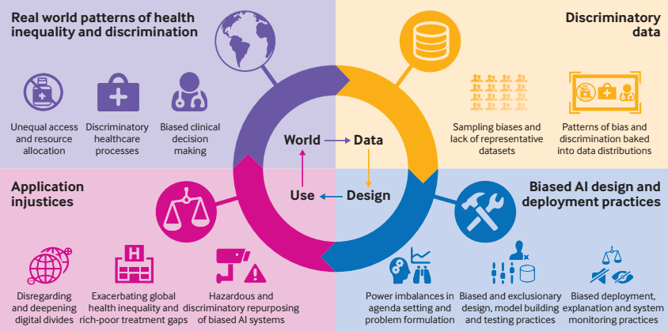
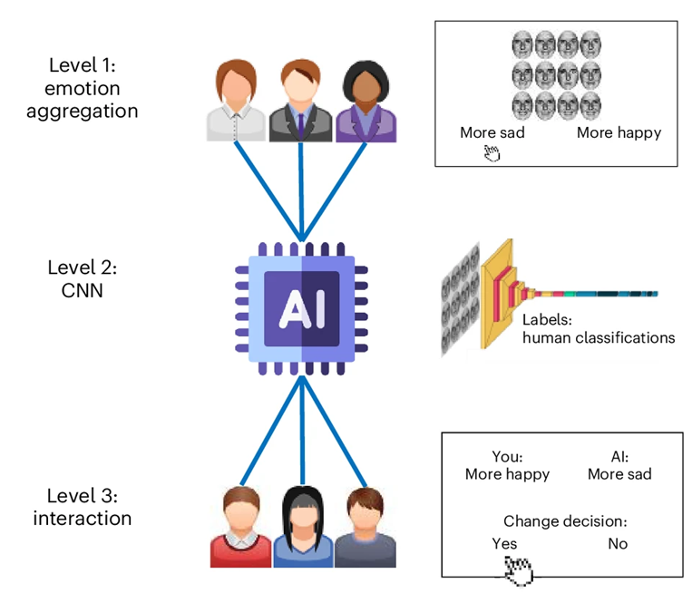
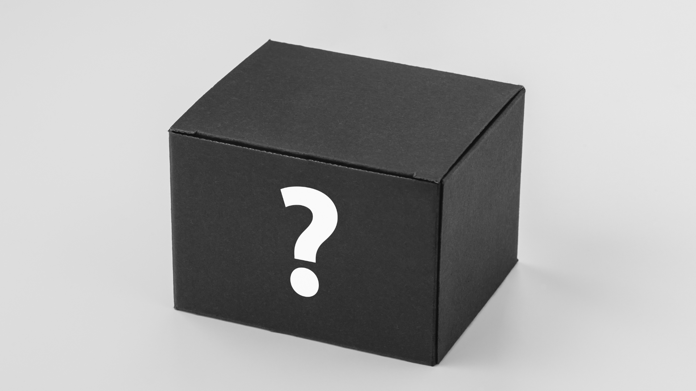
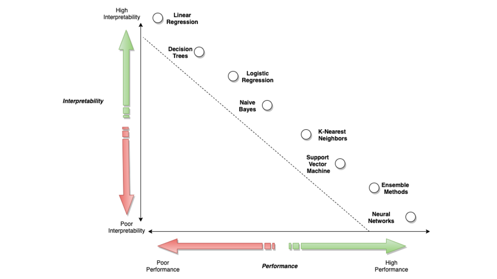
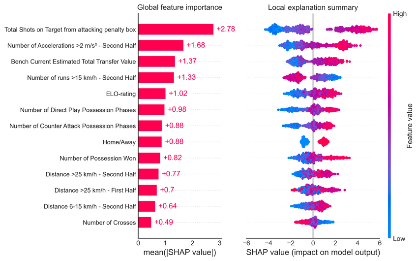
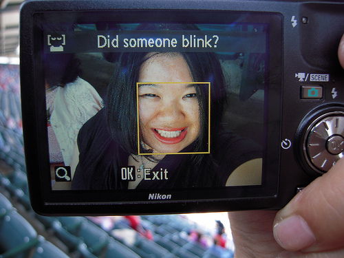

<!-- _class: first-slide -->

<small>🐍 82º Python Floripa</small>

# Equidade e Justiça em Sistemas de IA

**Marília Melo Favalesso**

---
## Marília Melo Favalesso  

🧠 Cientista de Dados | PhD

🐍 Python e Comunidades  

🐈 Gatos, pizza e bicicleta nas horas vagas

🔗 LinkedIn: [/mariliafavalesso](https://www.linkedin.com/in/mariliafavalesso/)

🔗 github: [/mmfava](https://github.com/mmfava)

---
# <!----fit-->O que estamos chamando de IA 

A **Inteligência Artificial (IA)** é um termo abrangente que se refere a sistemas automatizados de tomada de decisão, capazes de executar tarefas que tradicionalmente exigiriam inteligência humana.

---

# O impacto das ==decisões algorítmicas==

Embora aspirem imitar e automatizar o julgamento humano, a maioria dos algoritmos de IA são, na verdade, **modelos imperfeitos suscetíveis a erros e vieses**.

---

## Proposta de experimento

▶ Execute o seguinte prompt no chatGPT / DALL-E 3: 

**"Chat, pode gerar a imagem de uma pessoa liderança?"** 

  🤔 Qual foi o resultado? 

---

  
  
  
  
  
  
  
  
  
  

 

<small><small>DALL-E 3 (OpenAI) →🔗 https://chatgpt.com/share/67915ff0-4c64-800e-b74e-176c169d355f</small></small>

---

## Proposta de experimento 2

▶  Adicione ao prompt no chatGPT / DALL-E 3 a palavra "compassiva": 

**"Chat, pode gerar a imagem de uma pessoa liderança compassiva?"**

 🤔 Qual foi o resultado? 

---

  
  
  
  
  
  
  
  
  
  

 

<small><small>DALL-E 3 (OpenAI) →🔗 https://chatgpt.com/share/6792b433-02b0-800e-8352-052e2fb2f531</small></small>

---
### Reflexo da realidade?
 

==NÃO!== Os modelos são **enviesados**.

✶ Reforçam e amplificam estereótipos existentes.
✶ Sub ou sobre-representam certos grupos.
✶ Podem levar a discriminações sistêmicas.

 <small><small>**Ver:** Cheong et al. (2024), Currie et al. (2024), Mandal et al. (2024), Wu et al. (2024), Choudhry et al. (2023) e  Luccioni et al. (2023). </small></small>

<!---- 

Viés em Inteligência Artificial (IA) refere-se a padrões sistemáticos de erro em modelos de aprendizado de máquina que levam a previsões ou decisões injustas, distorcidas ou discriminatórias.

-->

---

#### Case 1: IA gerando imagens racistas

<small><small><small>**G1 (26/10/2023)** - Deputada denuncia IA por gerar imagem racista quando solicitado um personagem negro em uma favela. (🔗[link](https://g1.globo.com/tecnologia/noticia/2023/10/26/deputada-do-rj-diz-que-robo-que-faz-desenhos-ao-estilo-pixar-entregou-imagem-de-mulher-negra-com-arma-na-mao-ao-receber-pedido-de-personagem-em-favela.ghtml)).</small></small></small>
 

<strong>Prompt no <em>Bing Chat</em> da Microsoft (DALL-E):</strong> 
"Uma mulher negra, de cabelos afro, com roupas de estampa africana num cenário de favela".

---
#### Case 2: IA associando raça a crime

%2012.33.08_f345ba01.jpg)

<small><small><small>**Grupo LLM whatsapp (28/10/2024)** - IA da Meta gera imagem de um homem negro ao pedido de "pessoa que efetua atos errados na sociedade". </small></small></small>
 

<strong>Prompt no <em>Meta AI</em> do Whatsapp:</strong> 
"@Meta AI crie a imagem de uma pessoa que efetua atos errados na sociedade".

---
#### Case 3: IA associando raça a reincidência criminal

<small><small><small><mark>Old News!</mark> **ProPublica (23/05/2016)**: O artigo revela que o algoritmo COMPAS, usado no sistema judicial dos EUA para prever reincidência criminal, tem viés racial: ele superestima o risco de reincidência para pessoas negras (mais falsos positivos) e subestima para pessoas brancas (mais falsos negativos) ([🔗 link](https://www.propublica.org/article/machine-bias-risk-assessments-in-criminal-sentencing)).</small></small></small>
 

---
### Reflexo da sociedade?

==SIM!== 🏘️ ⇢ 👶

As IA apresentam "**posicionalidade**"!

✶ Posicionalidade é a forma como nossos **contextos sociais e políticos moldam nossa percepção do mundo**.

✶ Na IA, isso significa que **preconceitos e perspectivas humanas influenciam os sistemas de aprendizado de máquina**, pois refletem as escolhas feitas durante seu desenvolvimento.

---

<small><small><b>Ref:</b> Leslie et al. (2021)</small></small>

---
#### A IA amplifica vieses humanos

<small><small><b>Glickman and Sharot (2024)</b></small></small>
* IA reforça viés e influencia humanos a adotá-lo.
* Maior viés em interações humano-IA do que humano-humano.
* Percepção da IA como neutra favorece aceitação de vieses.
* IA imparciais podem melhorar julgamentos humanos.

---
# Mas o que é ser <u>justo</u>?

▶ **Responda:** 

Há apenas um leito disponível na UTI e dois pacientes em estado grave:

[1] 🧒 **Criança de 8 anos** - alta chance de recuperação.
[2] 🤰 **Mulher grávida de 32 anos** - sua vida não garante a do bebê.

 ==Quem deve receber o leito?==

---
# Mas o que é ser <u>justo</u>?

▶ **Responda:** 

Há apenas um leito disponível na UTI e dois pacientes em estado grave:

[1] 🧔‍♂️ **Homem de 40 anos** - baixa probabilidade de sobrevivência.
[2] 👵 **Mulher idosa de 75 anos** - probabilidade relativamente alta de sobrevivência.

 ==Quem deve receber o leito?==

---
## Definição de justiça 👩‍⚖️

#### Complexa!

▶ A noção de justiça **varia entre culturas e contextos**, refletindo valores e normas sociais.

▶ Em IA, é a busca por sistemas ==equitativos==, livres de discriminação ou vieses injustos.

---
# Equidade ≠ Igualdade

A equidade considera **diferenças individuais e estruturais**, garantindo que **todos tenham acesso às mesmas oportunidades**, mesmo que isso signifique **tratamentos diferenciados**.

#### Conceito bastante discutido, mas que também não é fácil

---

# Construindo um sistema justo

_"Viés algorítmico não é um problema meramente técnico, mas social e ético. Para mitigá-lo, devemos agir desde a coleta de dados até a governança do sistema."_

— **Cathy O’Neil**, autora de _Weapons of Math Destruction_

---
### 1️⃣ Propósito

IA deve ter um **objetivo claro** e ser a melhor solução para o problema. Sem um propósito bem definido, pode gerar impactos negativos e desperdício de recursos.

 

<strong>Surto do Ebola (2014) - </strong>
Pesquisadores usaram dados de mobilidade para prever surtos, mas o Ebola se espalha por contato direto. O foco deveria ter sido <b>redes de contato entre infectados</b>.

---

### 2️⃣ Dados

Dados enviesados reforçam desigualdades. **É necessário garantir a diversidade com qualidade**. Auditorias e engajamento de especialistas são consideradas boas práticas!

 

<strong>Liang et al. (2023) - </strong>Detectores de GPT estão enviesados contra "escritores" não-nativos do inglês.</b>

---

### 3️⃣ Abusabilidade

Os desenvolvedores de IA precisam antecipar **vulnerabilidades e cenários de uso indevido**. 

Algoritmos podem ser **sequestrados e transformados em ferramentas para fins maliciosos**, como manipulação, vigilância e desinformação.

 

<strong>Poder 360 (24/01/2024) - </strong>Deep Fake do Papa Francisco usando casaco da moda e divulgado por grandes veículos de mídia como verdade.  
<a href="https://www.poder360.com.br/internacional/alvo-de-deepfake-papa-pede-regulamentacao-de-ia/" target="_blank">[Link]</a>

---
### 4️⃣ Privacidade

Os sistemas de IA podem comprometer a **privacidade** dos usuários ao armazenar dados sensíveis, sujeitos a vazamentos e ataques. 

Para mitigar riscos, é essencial aplicar **segurança desde o design** e garantir o **controle do usuário** sobre seus dados.

 

<strong>Época Negócios (16/01/2025) - </strong>Brasileiros vendem registro da íris por R$600 para projeto Worldcoin de Sam Altam, CEO da OpenAI
<a href="https://epocanegocios.globo.com/tecnologia/noticia/2025/01/brasileiros-vendem-registro-de-iris-por-r-600-entenda-como-funciona-o-processo-e-quais-os-riscos.ghtml" target="_blank">[Link]</a>

---

### 5️⃣ Proxy

Algoritmos podem discriminar **indiretamente** ao usar variáveis correlacionadas a **atributos protegidos**, como raça ou gênero.

É de extrema importância a consulta a especialistas no assunto!  

 <strong>Ribeiro-Dantas et al. (2023) - </strong> O estado civil solteira foi indevidamente apontado como fator de risco para um tipo de câncer de mama. Os autores demonstram que a variável é um proxy de fatores socioeconômicos, como acesso ao diagnóstico médico adequado. 

---
### 6️⃣ Explicabilidade

Quem projeta e implementa sistemas algorítmicos tem a **responsabilidade de explicar decisões críticas** que impactam o bem-estar das pessoas.

 O usuário quer entender o motivo dos resultados, o motivo das falhas e quando e o quanto ele pode confiar na IA!

---

#### Interpretabilidade

Refere-se à capacidade de entender como um modelo de IA funciona e chega às suas conclusões. 
**Um modelo interpretável permite rastrear o impacto de cada entrada na saída.**
 <small><small>[🔗 Link da figura](https://docs.aws.amazon.com/whitepapers/latest/model-explainability-aws-ai-ml/interpretability-versus-explainability.html)</small></small>

---
#### Explicabilidade

Conjunto de processos e métodos que permite que usuários humanos **compreendam e confiem nos resultados e saídas** criados por algoritmos de aprendizado de máquina.
 <small><small>[🔗 Link da figura](https://media.geeksforgeeks.org/wp-content/uploads/20231201153509/Explainable-AI-Concept-1-660.png)</small></small>

---

### 7️⃣ Otimização

Definir métricas de sucesso para IA envolve **compensações e impactos colaterais**. É essencial equilibrar **desempenho e equidade**, minimizando riscos para populações vulneráveis.

 <strong>Shanklin et al. (2022) </strong> - O estudo mostra como algoritmos de IA podem perpetuar desigualdades raciais e propõe um método para equilibrar precisão e equidade, evitando discriminação sem comprometer a eficiência. 

---

### 8️⃣ Generalização

Entre o desenvolvimento e a implementação de um sistema de IA, **o mundo – e os usuários – podem mudar**, tornando o contexto original inadequado e levando a falhas inesperadas.  

Planos de retreino e descontinuidade são necessários! 

  

   

<strong>Time (22/01/2010) - </strong> Câmeras da Nikon não reconheciam corretamente rostos asiáticos, exibindo a mensagem "Alguém piscou?" mesmo com os olhos abertos.  
<a href="https://time.com/archive/6906847/are-face-detection-cameras-racist/" target="_blank">[Leia mais]</a>  

  

---

### 9️⃣ Monitoramento

Decisões algorítmicas devem ser **passíveis de revisão**, garantindo que indivíduos possam **questioná-las e corrigi-las**. 

Além disso, **monitoramento contínuo e transparência** são essenciais para evitar abusos e garantir responsabilidade no uso da IA.

---
**Reflexões finais**

# A IA ==não é neutra== – ela reflete as escolhas de quem a constrói e os dados que a alimentam!

---
**Reflexões finais**

#  Viés algorítmico não é apenas um problema técnico, mas ==social e ético==. 

A mitigação exige um olhar interdisciplinar.

---
**Reflexões finais**

# Precisamos equilibrar ==acurácia e equidade==, garantindo que sistemas de IA sejam justos e transparentes.

---
**Reflexões finais**

# A supervisão contínua e o direito à contestação são fundamentais para que a IA beneficie a sociedade sem reforçar desigualdades!

---

### Referências

1. Cheong, M. et al. (2024). _Investigating Gender and Racial Biases in DALL-E Mini Images_. [Online]. Available at: https://doi.org/10.1145/3649883 [Accessed 24 January 2025].
2. Choudhry, H. S. et al. (2023). _Perception of Race and Sex Diversity in Ophthalmology by Artificial Intelligence: A DALL E-2 Study_. [Online]. Available at: https://doi.org/10.2147/OPTH.S427296 [Accessed 24 January 2025].
3. Currie, G. et al. (2024). _Gender and Ethnicity Bias of Text-to-Image Generative Artificial Intelligence in Medical Imaging, Part 2: Analysis of DALL-E 3_. [Online]. Available at: https://doi.org/10.2967/jnmt.124.268359 [Accessed 24 January 2025].
4. Glickman, M. and Sharot, T. (2024). _How human–AI feedback loops alter human perceptual, emotional and social judgements_. [Online]. Available at: https://www.nature.com/articles/s41562-024-02077-2 [Accessed 24 January 2025].
5.  Leslie, D. et al. (2021). _Does “AI” stand for augmenting inequality in the era of covid-19 healthcare?_ [Online]. Available at: https://doi.org/10.1136/bmj.n304 [Accessed 24 January 2025].
6. Liang, W. et al. (2023). _GPT detectors are biased against non-native English writers_. [Online]. Available at: https://doi.org/10.48550/arXiv.2304.02819 [Accessed 24 January 2025].

---

### Referências
7. Luccioni, A. S. et al. (2023). _Stable Bias: Analyzing Societal Representations in Diffusion Models_. [Online]. Available at: https://doi.org/10.48550/arXiv.2303.11408 [Accessed 22 January 2025].
8. Mandal, A., Leavy, S. and Little, S. (2024). _Generated Bias: Auditing Internal Bias Dynamics of Text-To-Image Generative Models_. [Online]. Available at: https://doi.org/10.48550/arXiv.2410.07884 [Accessed 24 January 2025].
9. Ribeiro-Dantas, M. da C. et al. (2023). _Learning interpretable causal networks from very large datasets, application to 400,000 medical records of breast cancer patients_. [Online]. Available at: https://doi.org/10.48550/arXiv.2303.06423 [Accessed 24 January 2025].
10. Shanklin, R. et al. (2022). _Ethical Redress of Racial Inequities in AI: Lessons from Decoupling Machine Learning from Optimization in Medical Appointment Scheduling_. [Online]. Available at: https://doi.org/10.1007/s13347-022-00590-8 [Accessed 24 January 2025].
11. Wu, Y., Nakashima, Y. and Garcia, N. (2024). _Gender Bias Evaluation in Text-to-image Generation: A Survey_. [Online]. Available at: https://doi.org/10.48550/arXiv.2408.11358 [Accessed 24 January 2025].

---
<!-- Texto Principal -->

Obrigada!

<!-- Linha Divisória -->

  <b>Marília Melo Favalesso - PhD, Cientista de Dados<b>

<!-- Redes Sociais -->

  <a href="https://www.linkedin.com/in/seuusuario" target="_blank">🔗 LinkedIn: /mariliafavalesso</a>
  <a href="mailto:seuemail@example.com">✉️ Email: marilia.melo.favalesso@gmail.com</a>

